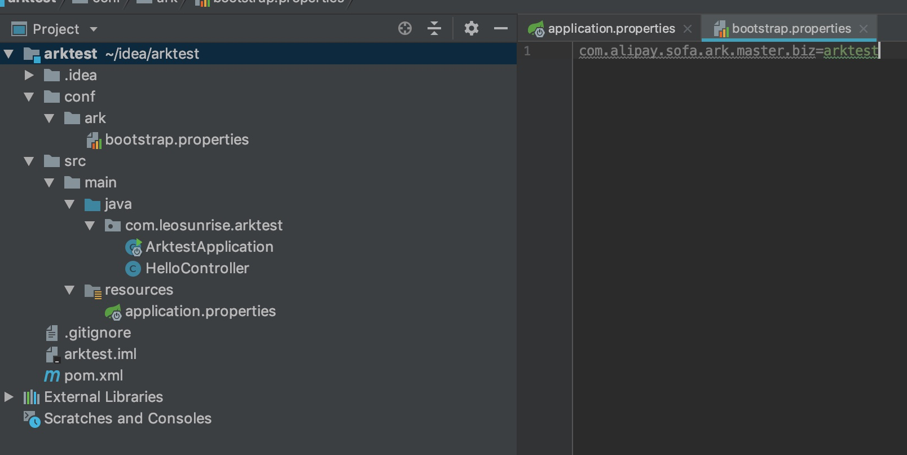
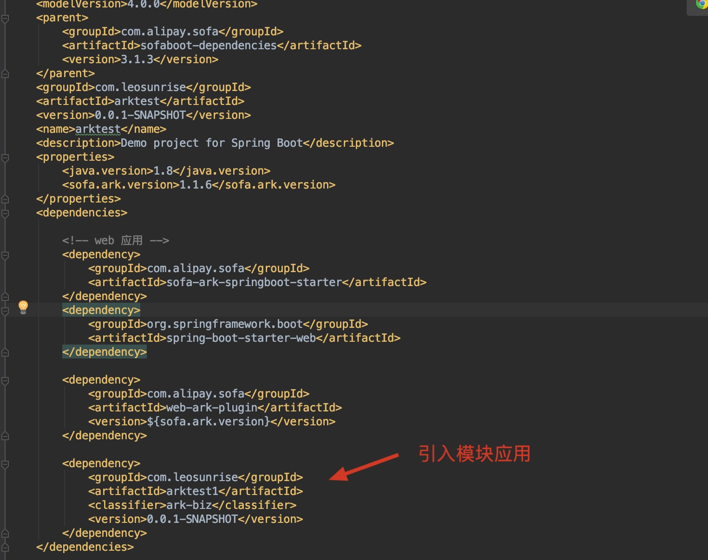
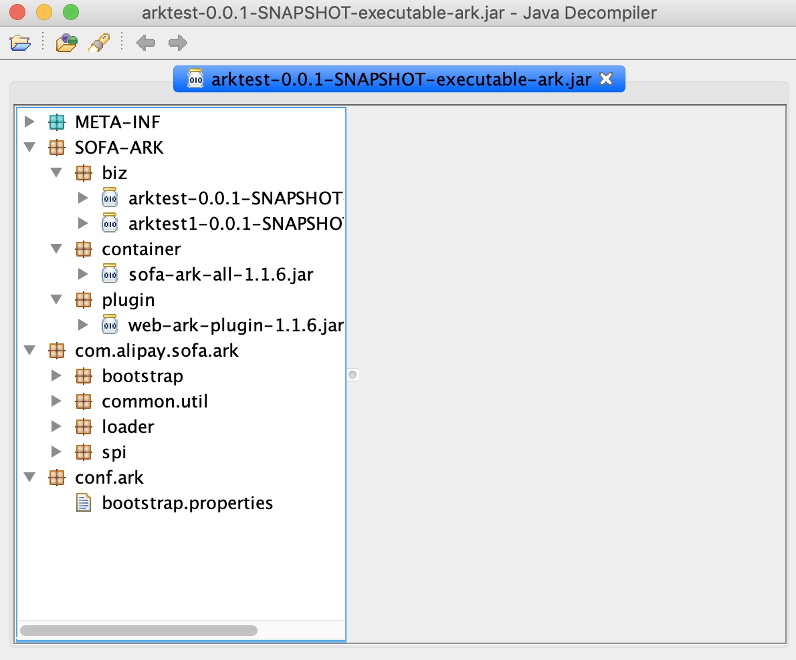

SOFABoot 多模块部署
--------------------
# 简介
 SOFAArk 是一款基于 Java 实现的轻量级类隔离容器，主要提供类隔离和应用(模块)合并部署能力，由蚂蚁金服公司开源贡献；  
 
 在大型软件开发过程中，通常会推荐底层功能插件化，业务功能模块化的开发模式，以期达到低耦合、高内聚、功能复用的优点。基于此，SOFAArk 提供了一套较为规范化的插件化、模块化的开发方案，产品能力主要包括：  
 
 * 定义类加载模型，运行时底层插件、业务应用(模块)之间均相互隔离，单一插件和应用(模块)由不同的 ClassLoader 加载，可以有效避免相互之间的包冲突，提升插件和模块功能复用能力；
 * 定义插件开发规范，提供 maven 打包工具，简单快速将多个二方包打包成插件（Ark Plugin，以下简称 Plugin）
 * 定义模块开发规范，提供 maven 打包工具，简单快速将应用打包成模块 (Ark Biz，以下简称 Biz)
 * 针对 Plugin、Biz 提供标准的编程界面，包括服务、事件、扩展点等机制
 * 支持多 Biz 的合并部署，开发阶段将多个 Biz 打包成可执行 Fat Jar，或者运行时使用 API 或配置中心(Zookeeper)动态地安装卸载 Biz
 基于以上能力，SOFAArk 可以帮助解决依赖包冲突、多应用(模块)合并部署等场景问题。
 
 GitHub: https://github.com/sofastack/sofa-ark
 
 # 非宿主应用
  
 ## 依赖
  
 ## 增加build插件
 ```bash
 <build>
 		<plugins>
 			<plugin>
 				<groupId>com.alipay.sofa</groupId>
 				<artifactId>sofa-ark-maven-plugin</artifactId>
 				<executions>
 					<execution>
 						<id>default-cli</id>
 
 						<!--goal executed to generate executable-ark-jar -->
 						<goals>
 							<goal>repackage</goal>
 						</goals>
 
 						<configuration>
 							<!--specify destination where executable-ark-jar will be saved, default saved to ${project.build.directory}-->
 							<outputDirectory>./target</outputDirectory>
 
 							<!--default none-->
 							<arkClassifier>executable-ark</arkClassifier>
 							<attach>true</attach>
 						</configuration>
 					</execution>
 				</executions>
 			</plugin>
 		</plugins>
 	</build>

```
## 打包
```bash
mvn clean install -Dmaven.test.skip=true
``` 
 

# 宿主应用
 
## 应用配置
```bash
server.port=8080 ##由于两个web应用所以端口需要和非宿主不一样
spring.application.name=arktest
```
## 注册宿主应用
```bash
com.alipay.sofa.ark.master.biz=arktest
```
## 依赖
  
 
## 增加build插件
```bash
<build>
		<plugins>
			<plugin>
				<groupId>com.alipay.sofa</groupId>
				<artifactId>sofa-ark-maven-plugin</artifactId>
				<executions>
					<execution>
						<id>default-cli</id>

						<!--goal executed to generate executable-ark-jar -->
						<goals>
							<goal>repackage</goal>
						</goals>

						<configuration>
							<!--specify destination where executable-ark-jar will be saved, default saved to ${project.build.directory}-->
							<outputDirectory>./target</outputDirectory>

							<!--default none-->
							<arkClassifier>executable-ark</arkClassifier>
						</configuration>
					</execution>
				</executions>
			</plugin>
		</plugins>
	</build>
```

## 打包
```bash
mvn clean install -Dmaven.test.skip=true
``` 
 

## 运行
```bash
 java -jar arktest-0.0.1-SNAPSHOT-executable-ark.jar
```

## 测试
 
 
