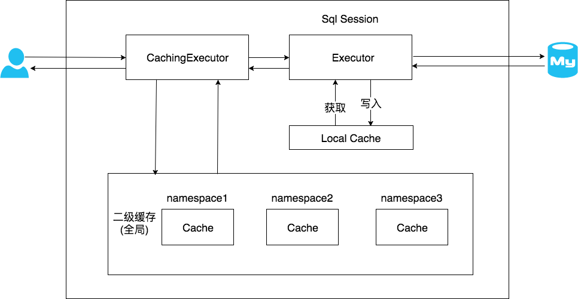

# 一、Mybatis 一级缓存
开启一级缓存：<setting name="localCacheScope" value="SESSION"/>
1、MyBatis一级缓存的生命周期和SqlSession一致。
2、MyBatis一级缓存内部设计简单，只是一个没有容量限定的HashMap，在缓存的功能性上有所欠缺。
3、MyBatis的一级缓存最大范围是SqlSession内部，有多个SqlSession或者分布式的环境下，数据库写操作会引起脏数据，建议设定缓存级别为Statement。

  

# 二、Mybatis 二级缓存
一级缓存最大的共享范围是一个SqlSession，如果需要多个sqlsession之间共享则需要使用二级缓存，开启二级缓存后，会使用CachingExecutor装饰Executor，进入一级缓存的查询流程前，先在CachingExecutor进行二级缓存的查询。
二级缓存开启后，同一个namespace下的所有操作语句，都影响着同一个Cache，即二级缓存被多个SqlSession共享，是一个全局的变量。
当开启缓存后，数据的查询执行的流程就是 二级缓存 -> 一级缓存 -> 数据库。

  

# 三、要正确的使用二级缓存，需完成如下配置的。
1、在MyBatis的配置文件中开启二级缓存。<setting name="cacheEnabled" value="true"/>
在MyBatis的映射XML中配置cache或者 cache-ref 。

cache标签用于声明这个namespace使用二级缓存，并且可以自定义配置。<cache/>
type：cache使用的类型，默认是PerpetualCache，这在一级缓存中提到过。
eviction： 定义回收的策略，常见的有FIFO，LRU。
flushInterval： 配置一定时间自动刷新缓存，单位是毫秒。
size： 最多缓存对象的个数。
readOnly： 是否只读，若配置可读写，则需要对应的实体类能够序列化。
blocking： 若缓存中找不到对应的key，是否会一直blocking，直到有对应的数据进入缓存。

cache-ref代表引用别的命名空间的Cache配置，两个命名空间的操作使用的是同一个Cache。
<cache-ref namespace="mapper.StudentMapper"/>

# 四、小结
MyBatis的二级缓存相对于一级缓存来说，实现了SqlSession之间缓存数据的共享，同时粒度更加的细，能够到namespace级别，通过Cache接口实现类不同的组合，对Cache的可控性也更强。
MyBatis在多表查询时，极大可能会出现脏数据，有设计上的缺陷，安全使用二级缓存的条件比较苛刻。
在分布式环境下，由于默认的MyBatis Cache实现都是基于本地的，分布式环境下必然会出现读取到脏数据，需要使用集中式缓存将MyBatis的Cache接口实现，有一定的开发成本，直接使用Redis,Memcached等分布式缓存可能成本更低，安全性也更高。
